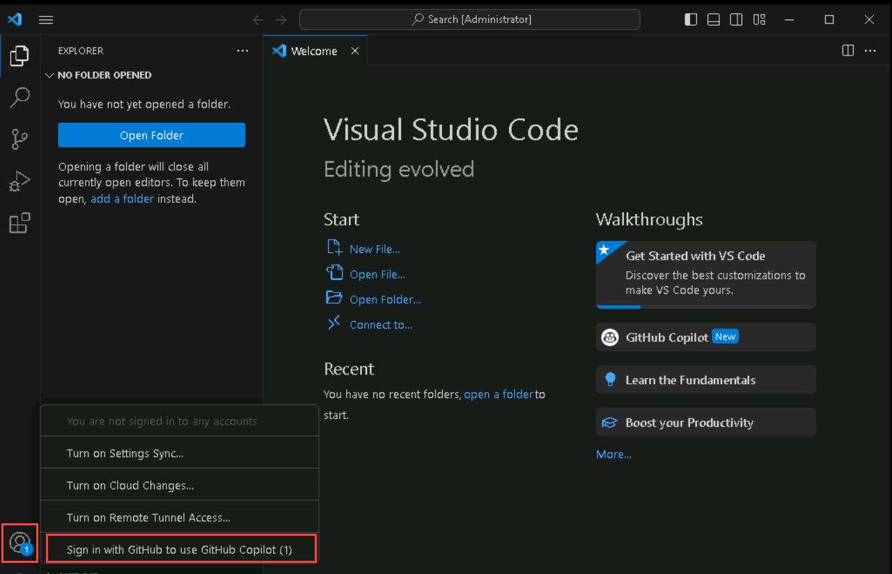

# Exercise 1: Introduction to GitHub Copilot

GitHub Copilot is an AI pair programmer that helps you write code faster and with less work. It draws context from comments and code to suggest individual lines and whole functions instantly. GitHub Copilot is powered by OpenAI Codex, a generative pretrained language model created by OpenAI.

**Copilot works with many code editors including VS Code, Visual Studio, JetBrains IDE, and Neovim.**

Additionally, GitHub Copilot is trained on all languages that appear in public repositories. For each language, the quality of suggestions you receive may depend on the volume and diversity of training data for that language.

Using Copilot inside a Codespace shows how easy it is to get up and running with GitHub's suite of [Collaborative Coding](https://github.com/features#features-collaboration) tools.

## Task 1: Install the GitHub Copilot extension and Copilot Chat extensions in Visual Studio Code

1. Open Visual Studio Code from the desktop screen. In Visual Studio Code, open the Extensions view by clicking the Extensions icon in the activity bar on the left side of the Visual Studio Code window.

   

   

2. In the "Search Extensions in Marketplace" search box, search for the **GitHub Copilot** extension, then click Install.

   

3. Again in the "Search Extensions in Marketplace" search box, search for the **GitHub Copilot Chat** extension, then click Install.
  
4. Now, from the left navigation pane click on the user icon and select **Sign in with Github to use Github copilot** and authorize Visual Studio Code with your github account.

   

5. To confirm that GitHub Copilot Chat has been successfully installed, in the activity bar on the left side of the Visual Studio Code window, click the GitHub Copilot Chat icon to open the GitHub Copilot Chat chat window.

   

## Task 2: GitHub Copilot Code Generation

1. In the Visual Studio Code activity bar, click the GitHub Copilot Chat icon to open the GitHub Copilot Chat window.

    
  
2. At the bottom of the GitHub Copilot Chat window, in the Ask Copilot a question or type / for topics text box, type a coding-related question, then press Enter. For example, type "How do I write a function that returns the sum of two numbers?

3. GitHub Copilot Chat will process your question and provide an answer, with code suggestions, in the chat window.

   

## Task 3: Analyzing the Generated Code

1. In the GitHub Copilot Chat window, to show the options for a code suggestion, hover over the suggestion.

   

2. Choose one of the options for using the code suggestion:
   
   -To copy the code suggestion to your clipboard, click the Copy icon.
   
   -To insert the code suggestion into your code at the current location of your cursor, click the Insert at Cursor icon.

4. To view additional options, click the ... icon:
   
   -To create a new file and insert the suggestion into it, click Insert Into New File.
   
   -To run the code suggestion in the Visual Studio Code terminal, click Run in Terminal.

## Task 4: Code Explanation Using Github Copilot

1. Open your file in Visual Studio Code.
2. Ask Copilot Chat a question about the file, like, "What does this file do?"
