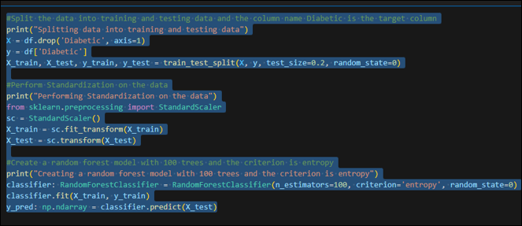
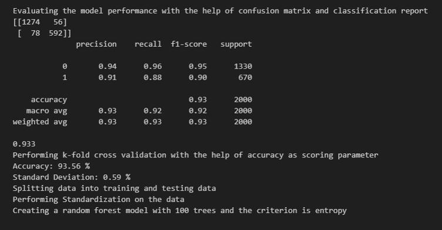

# Exercise 10: Getting Started with GitHub Copilot Labs [Optional]

GitHub Copilot is a groundbreaking AI pair programmer, and we're just at the beginning of exploring its potential. Copilot's technical preview has improved the quality of suggestions and added safety features. However, it's clear that Copilot has the potential to offer more than just code suggestions.

>**Disclaimer**: GitHub Copilot will automatically suggest an entire function body or code in gray text. Following are some examples of what you'll likely encounter in this lab, though the specific suggestions may differ:

## Task 1: Download Copilot Labs from the VS Code Extensions Marketplace

1. In the Vs-Code, open the **Extensions (1)** tab and search for **GitHub Copilot Labs (2)** and then clcik on **Install(3)**.

   

1. As soon as you download the extension, you will see a prompt to sign in.

   

1. When you click the 'Sign In' button in the browser window, it should open GitHub's authentication page, requesting your authorization. Click Continue.  

1. A pop-up for 'Open Visual Studio Code.app' will now appear. Click on it to proceed.

   

1. Back on VS Code, a pop-up will appear asking to allow the Copilot Extension to open the URI. Click open to continue.

   

1. Close or exit VS Code, then run VS Code again.

1. Now click on the icon marked in red to open the Copilot Labs Section.

   

## Task 2: Working with Copilot Tools

1. Code Explanation- This tool explains the code. To use this feature, select the code for which you want an explanation and navigate to the tools section, then click **Ask Copilot**.

   

1. Once you click Ask Copilot, you will find the explanation of the code below.

   

1. Rectifying any error or bugs (Fix Bug)- This tool automatically rectifies the bug or error in the code provided. To use the code, you need to select the code to check and then 
   click on 'Fix Bug' present inside the 'Brushes' section.

   

1. Here’s an example of how this works: In the first image,, the wrong library was imported, and after using the "Fix bug" feature, we can see that the issue was resolved.
   
   

   

1. In the next step, we have the debugging tool. This tool is primarily used if there are any issues in the code or if you want to add some breakpoints. Using break points, you can
   understand the output and flow of the code by looking at the print statements after each function For e.g.

   

1. After using the debug tool, here’s the output of the code.

   

1. A tool like this is important if you are trying to work on different matrixes or if you want to visualize the code. This code generally provides a visual output for better
   understanding.  To start with this, you need to select the code and use the tool.

   

1. The resulting output is represented as shown below.

   

### Summary

In this exercise, you have worked on GitHub Copilot Labs and its related features.
   
