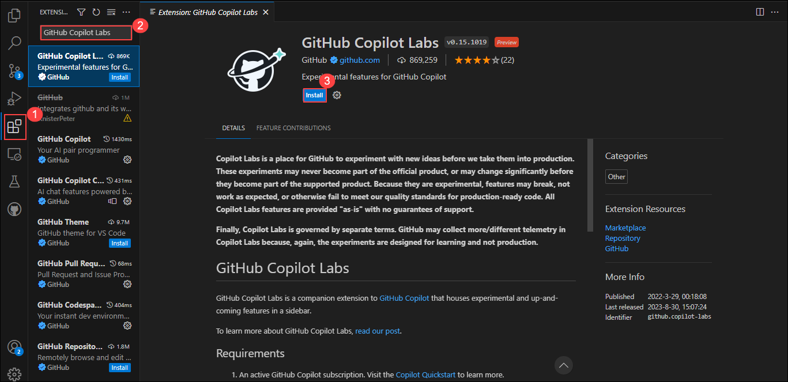
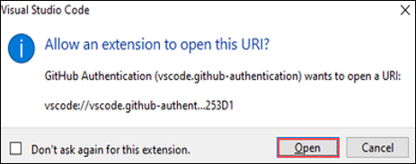
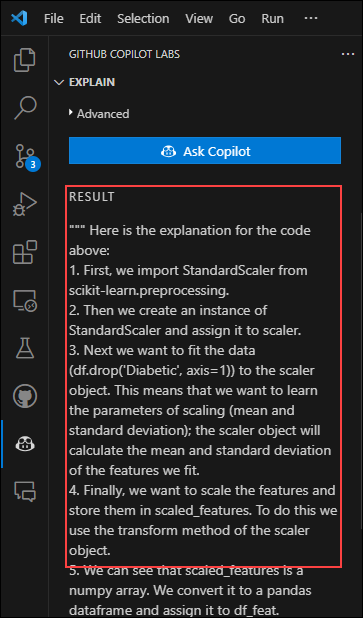
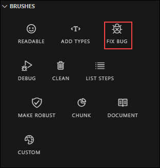
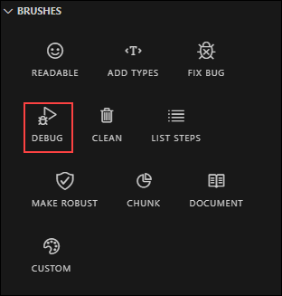

# Exercise 10: Getting started with GitHub Copilot Labs

GitHub Copilot is a groundbreaking AI pair programmer, but we're only just beginning to explore its potential. Copilot's technical preview has improved the quality of suggestions and added 
safety features, but it's easy to see how Copilot can go beyond code suggestions.

>**Disclaimer**: GitHub Copilot will automatically suggest an entire function body or code in gray text. Examples of what you'll most likely see in this lab, but the exact suggestion may 
vary.

## Task 1: Download Copilot Labs from the Vs code Extensions marketplace

1. In the Vs-Code, open the **Extensions (1)** tab and search for **GitHub Copilot Labs (2)** and then clcik on **Install(3)**.

   

1. As Soon as you download the extension you will see a prompt that’s says sign in.

   

1. Clicking on the sign in browser window should now open to GitHub's authentication page to ask for your authorization. Click Continue.  

1. An Open Visual Studio Code. App? pop-up will now appear. Click on Open Visual Studio Code.app to continue

   

1. Back on VS Code, a pop-up will appear asking to allow the Copilot Extension to open the URI. Click Open to continue.

   

1. Close / Exit VS Code then run VS Code again.

1. Now click on the Icon marked in red to open the Copilot labs Section.

   

## Task 2: Working with copilot tools

1. Code Explanation- This tool explains the code. To use this feature, select the code for which you want an explanation and navigate to the tools section, then click **Ask Copilot**.

   

1. Once you click the Asl Copilot,  you will find the explanation of the code below.

   

1. Rectifying any error/bugs (Fix Bug)- This tool automatically rectifies the bug/error in the code provided. To use the code, you need to select the code you need to check and then 
   click on Fix Bug present inside the Brushes section.

   

1. Here’s an example of how this works in the first image wrong library was imported then after using the fix bug 	we can see that the issue was resolved.

   

   

1. In the next step we have the debugging tool. This tool is primarily used if there are any issues in the code or if you want to add some breakpoints. Using break points, you can 
   understand the output and flow of the code by looking at the print statements after each function. For e.g.

   

1. After using the debug tool here’s the output of the code.

   

1. A tool like this is important if you are trying to work on different matrixes, or if you want to visualize the code. This code generally provides a visualized output for better 
   understanding. To start with this, you need to select the code and use the tool.

   

1. After which the output is represented as shown below.

   
   
