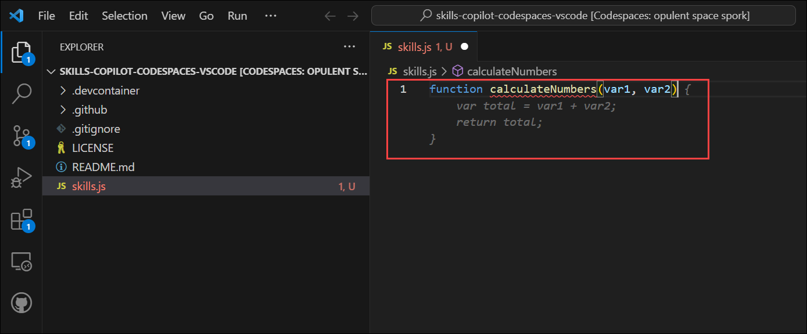

# Exercise 2: Seeing AI code suggestions in a JavaScript file

GitHub Copilot provides suggestions for numerous languages and a wide variety of frameworks, but works especially well for Python, JavaScript, TypeScript, Ruby, Go, C# and C++. The following samples are in JavaScript, but other languages will work similarly.

In this exercise, you will try out utilizing Javascript for Copilot.

>**Disclaimer**: GitHub Copilot will automatically suggest an entire function body or code in grayed text. Examples of what you'll most likely see in this exercise, but the exact suggestion may vary.

## Task 1: Add a JavaScript file and start writing code

1. From the VS Code explorer window, create a new file.

   

1. Name the file `skills.js` and verify your new file looks as shown below:

   

1. In the `skills.js` file, type the following function header.

   ```
   function calculateNumbers(var1, var2)
   ```

   GitHub Copilot will automatically suggest an entire function body in grayed text. Below is an example of what you'll most likely see, but the exact suggestion may vary.

   

1. Press `Tab` to accept the suggestion and then save the file.

   

## Task 2: Push code to your repository from the codespace

In this task, you will use the VS Code terminal to add the `skills.js` file to the GitHub repository.

1. Open VS Code Terminal by clicking on **Ellipsis (...)** **(1)**, select **Terminal** **(2)** and click on **New Terminal** **(3)**.

   

1. Run the below command to add the `skills.js` file to the GitHub repository.

   ```
   git add skills.js
   ```

1. Next from the VS Code terminal stage and commit the changes to the repository:

   ```
   git commit -m "Copilot first commit"
   ```

1. Finally from the VS Code terminal push the code to the repository:

   ```
   git push
   ```

   

   >**Note**: Wait about 60 seconds then refresh your GitHub repository landing page for the next step.

1. Click on **Next** from the bottom right to continue with the next exercies.
