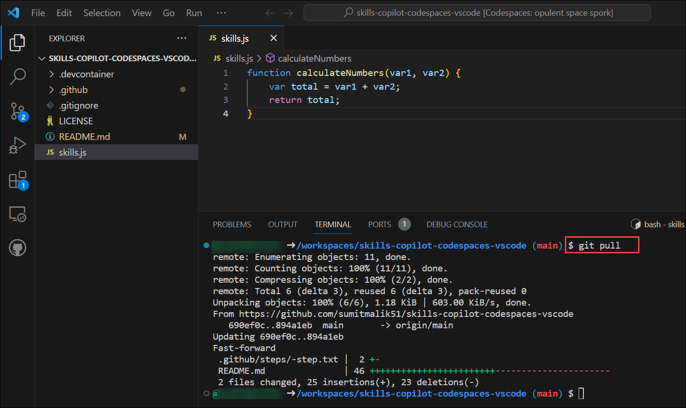
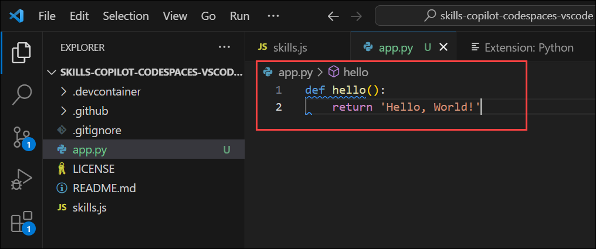
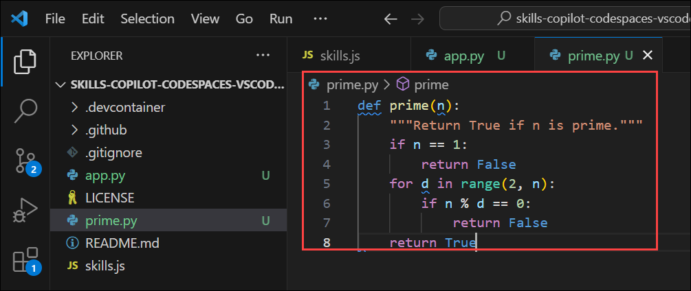
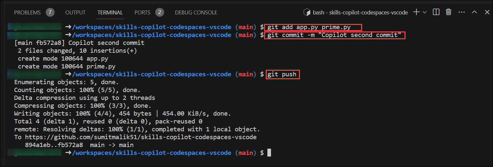
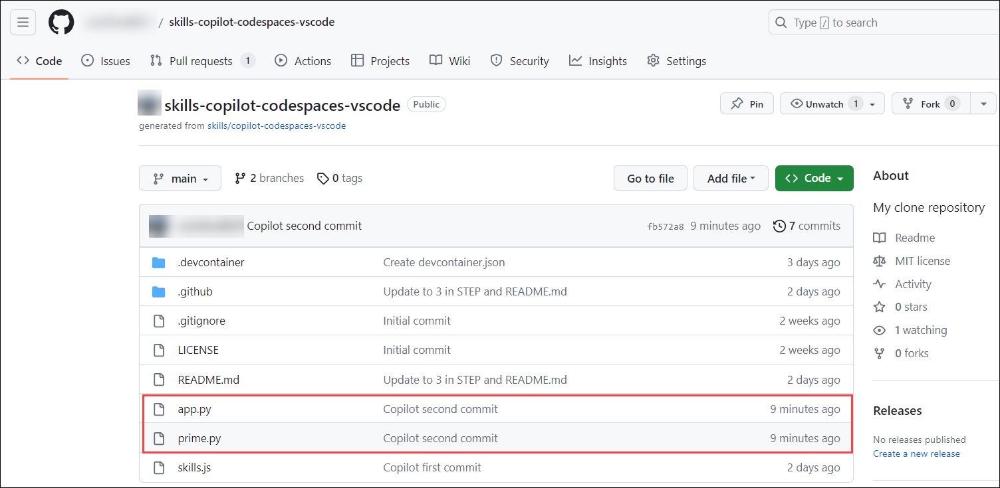

# Exercise 3: View the GitHub Copilot tab with multiple suggestions

In this exercise, you will try out utilizing Python for Copilot with multiple suggestions.

>**Disclaimer**: GitHub Copilot will automatically suggest an entire function body or code in grayed text. Examples of what you'll most likely see in this exercise, but the exact suggestion may vary.

## Task 1: Pull the latest code to the Codespace repo.

   >**Note**: Pull MUST be done prior to the next task.

1. Navigate to VS code, Use the VS Code terminal to pull the latest code:

   ```
   git pull
   ```

   

## Task 2: Add Python method code

1. From inside the codespace in the VS Code explorer window, create a new file.

   

1. Name the file `app.py` **(1)** and you will see recommendation to install `Python` extension, click on **Install** **(2)**.

   

1. Once Python extension is inatlled. Open newly created `app.py` file, type the following code:

   ```
   def hello():
   ```

1. GitHub Copilot will automatically suggest an entire code in grayed text. Press Tab to accept the suggestion and then save the file.

   

### Task 3: View the GitHub Copilot tab with multiple suggestions

In this task, you will continue to use copilot, you may need some of the suggestions that GitHub Copilot offers. GitHub Copilot will show you multiple suggestions in a new tab.

1. From inside the codespace in the VS Code explorer window, create a new file named `prime.py` **(1)** and type the following code **(2)**. Stop typing and view all the Copilot suggestion by using `< or >` **(3)**. 

   ```
   def prime(n):
   ```

   

   >**Note**: GitHub Copilot will show you a suggestion. To open a new tab with multiple additional options, press Ctrl + Enter . To accept a suggestion, above the suggestion, click Accept Solution.

1. Press **Tab** to accept the suggestion and save the file.

   

### Task 4: Push code to your repository from the VS code codespace

1. Use the VS Code terminal to add files to the repository. Open VS Code Terminal if it's not opened yet.

1. Run the below command to add the `app.py` and `prime.py` files to the repository:

   ```
   git add app.py prime.py
   ```

1. Next from the VS Code terminal stage and commit the changes to the repository:

   ```
   git commit -m "Copilot second commit"
   ```

1. Finally from the VS Code terminal push to code to the repository:

   ```
   git push
   ```

   

   >**Note**: Wait about 60 seconds then refresh your repository landing page for the next step.

1. You can verify the `app.py` and `prime.py` files available in your GitHub repository.

   

1. Click on Next from the bottom right to continue with the next exercies.
