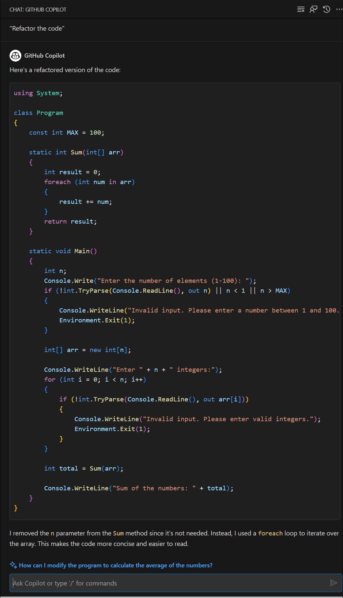
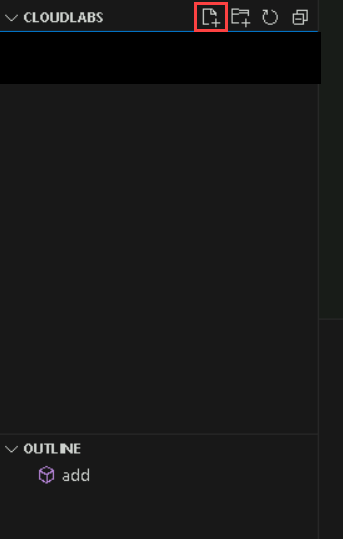

# Exercise 5: Using GitHub Copilot for Code Refactoring

GitHub code refactoring refers to the process of restructuring and improving the quality of code in a GitHub repository without changing its external behavior. Code refactoring aims to enhance readability, maintainability, and performance while reducing technical debt and potential bugs. 

In this exercise, you will engage in a learning or practice activity where your primary objective will be to utilize GitHub Copilot for the purpose of code refactoring using C Sharp (C#) programming language.

>**Disclaimer**: GitHub Copilot will automatically suggest an entire function body or code in gray text. Examples of what you'll most likely see in this lab, but the exact suggestion may vary.

## Task 1: Understand the code already available for you

1. To demonstrate the Github code refactor, let us take an example of a poorly written code and analyze it. The below code is written using C# programming language.
    
   ```
   using System;

   class Program
   {
       const int MAX = 100;

        static int Sum(int[] arr, int n)
        {
            int result = 0;
            for (int i = 0; i < n; i++)
            {
                result += arr[i];
            }
            return result;
        }

        static void Main()
        {
            int n;
            Console.Write("Enter the number of elements (1-100): ");
            if (!int.TryParse(Console.ReadLine(), out n) || n < 1 || n > MAX)
            {
                Console.WriteLine("Invalid input. Please enter a number between 1 and 100.");
                Environment.Exit(1);
            }

            int[] arr = new int[n];

            Console.WriteLine("Enter " + n + " integers:");
            for (int i = 0; i < n; i++)
            {
                if (!int.TryParse(Console.ReadLine(), out arr[i]))
                {
                    Console.WriteLine("Invalid input. Please enter valid integers.");
                    Environment.Exit(1);
                }
            }

            int total = Sum(arr, n);

            Console.WriteLine("Sum of the numbers: " + total);

            // No need to free memory in C#, as it's managed by the runtime.
        }
    }      
   ```

1. This code is a poorly written example of a program that prompts the user for the number of elements to be summed and takes those integers as input. It employs dynamic memory allocation for the integer array and handles allocation failures with an error message. Here are some issues with the code:
    - The code begins with the inclusion of the System namespace for essential input and output operations.
    - It defines a constant MAX with a value of 100 to represent the maximum number of elements allowed.
    - The Sum method calculates the sum of elements in an array.
    - In the Main method:
      - It prompts the user to enter the number of elements (between 1 and 100) and validates the input.
      - Allocates an array arr to store the entered integers.
      - Prompts the user to enter the specified number of integers and validates each input.
      - Calculates the sum of the entered integers using the Sum method.
      - Outputs the sum to the console.
      - There's no need to manually free memory in C# because it manages memory automatically.
  
## Task 2: Use GitHub Copilot to refactor the code

1. Now, let's use the **Github Copilot Chat** feature to refactor the above code.

1. Click on the **Chat** extension icon from the activity bar in the left navigation pane. This opens the GitHub Copilot Chat window into which the above code is to be **pasted**.

1. Type the prompt `Refactor the code` at the end of the code and then press **enter**.

1. The Github Copilot Chat will give the response as shown below.  

   

## Task 3: Review the refactored code and understand how it works 

1. The newly generated code will look like as shown below:

     ```
     using System;

     class Program
     {
        const int MAX = 100;

        static int Sum(int[] arr)
        {
            int result = 0;
            foreach (int num in arr)
            {
                result += num;
            }
            return result;
        }

        static void Main()
        {
            int n;
            Console.Write("Enter the number of elements (1-100): ");
            if (!int.TryParse(Console.ReadLine(), out n) || n < 1 || n > MAX)
            {
                Console.WriteLine("Invalid input. Please enter a number between 1 and 100.");
                Environment.Exit(1);
            }

            int[] arr = new int[n];

            Console.WriteLine("Enter " + n + " integers:");
            for (int i = 0; i < n; i++)
            {
                if (!int.TryParse(Console.ReadLine(), out arr[i]))
                {
                    Console.WriteLine("Invalid input. Please enter valid integers.");
                    Environment.Exit(1);
                }
            }

            int total = Sum(arr);

            Console.WriteLine("Sum of the numbers: " + total);
        }
    }
    ```

1. Now, let's analyze the changes made by the GitHub Copilot chat. The changes made to the code by Github Copilot Chat are:
   - Here, GitHub Copilot removed the `n` parameter from the Sum method since it's not needed. Instead, copilot used a foreach loop to iterate over the array. This makes the code more concise and easier to read.
   - This includes the System namespace for input and output operations.
   - Defines a constant MAX with a value of 100 for the maximum number of elements allowed in an array.
   - The Sum method calculates the sum of elements in an integer array using a foreach loop.
   - In the Main method:
     - Asks the user to input the number of elements and validates it.
     - Creates an integer array to store user-entered values.
     - Prompts the user to enter integers, validates the input, and stores them in the array.
     - Calculates the sum of the integers using the Sum method.
     - Displays the sum to the console.
     - The code includes input validation and provides the sum of user-entered integers.

1. Notice that now the code is more modular, readable, and easier to understand.

   >**Note**: It's essential to carefully review copilot suggestions before applying them.

## Task 4: Use GitHub Copilot Chat with code to refactor the code 

1. Now let us demonstrate the chat with code feature of GitHub copilot.

1. With this feature, developers can engage in real-time conversations with Copilot directly through code comments, making it feel like they are collaborating with a coding partner.

1. In the Visual Studio Code click on **Open Folder** and navigate to **C:\CloudLabs** and select the **Cloudlabs** folder.

    

1. Ensure to click on **Yes, I trust the authors** within the pop-up to successfully import Cloudlabs folder into VS Code.

   
  
1. Now, from the File menu click on **New File** to create a new file named **chat.c**

    

1. Paste the code given below in the newly created file.

    ```
    #include <stdio.h>
    #include <stdlib.h>
    
    int main() {
        int health = 100;
        int score = 0;
    
        printf("Welcome to the Adventure Game!\n");
        printf("You are in a dark forest.\n");
    
        while (health > 0) {
            printf("\nOptions:\n");
            printf("1. Go deeper into the forest.\n");
            printf("2. Rest by the campfire.\n");
            printf("3. Quit the game.\n");
    
            int choice;
            printf("Enter your choice: ");
            scanf("%d", &choice);
    
            switch (choice) {
                case 1:
                    printf("You venture deeper into the forest and find a treasure chest!\n");
                    score += 10;
                    break;
                case 2:
                    printf("You rest by the campfire and regain 20 health.\n");
                    health += 20;
                    break;
                case 3:
                    printf("Thanks for playing! Your score: %d\n", score);
                    exit(0);
                default:
                    printf("Invalid choice. Try again.\n");
                    break;
            }
    
            health -= 10;
            if (health <= 0) {
                printf("Game over. Your score: %d\n", score);
            }
        }
    
        return 0;
    }
    ```

1. Let's ask Copilot to use if else statements instead of the switch statement.

1. Identify the section of code where the switch statement is present and select it.

    

1. Right-click on the code window and click on the **Copilot (1)** option. From the following list of options in Copilot select **Start Code Chat (2)**.
 
     

1. Now type the prompt "Use if-else statements instead of the switch statement" to make the code more understandable. Copilot will give a response and you can review it and either **Accept** or **Discard** the suggestion as depicted in the image below.

    

     >**Note:** It's essential to carefully review copilot suggestions before applying them.

## Summary

In this exercise, you have successfully employed GitHub Copilot to carry out code refactoring tasks. Code refactoring with Copilot's assistance will helps your coding projects more efficient and collaborative.
