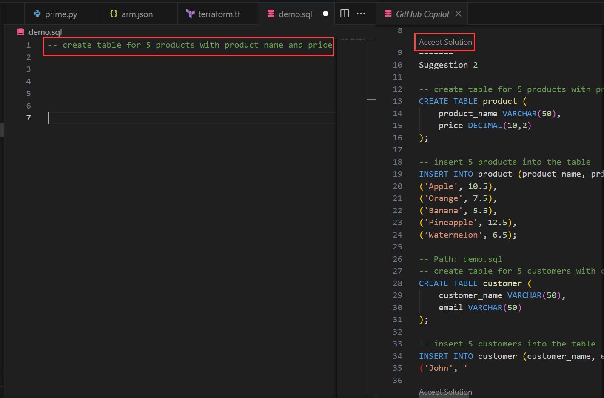

# Exercise 6: Using GitHub Copilot for T-SQL and YAML code

In this exercise, the primary objective is to leverage the capabilities of GitHub Copilot, a powerful AI-assisted coding tool, to assist you in generating code for two distinct programming languages: T-SQL and YAML. You can leverage comments to generate Copilot suggestions!

>**Disclaimer**: GitHub Copilot will automatically suggest an entire function body or code in grayed text. Examples of what you'll most likely see in this exercise, but the exact suggestion may vary.

### Task 1: Generate SQL Query with GitHub Copilot using comments

1. From inside the codespace in the VS Code explorer window, create a new file.

    

1. Name the file `demo.sql` and type the below comment:

   ```
   -- create table for 5 products with product name and price
   ```

1. To open a new tab with multiple synthesized solutions, press `Ctrl + Enter`. GitHub Copilot will synthesize around 10 different code suggestions in a new tab. You can view the solutions and to accept a suggestion, you need to click on Accept Solution above the suggestion and then save the file.

   

1. After accepting the suggestion, review it carefully before applying them.

   

   >**Note**: You may not see the same suggestions as shown in the screenshot, exact suggestion may vary

### Task 2: 
   
