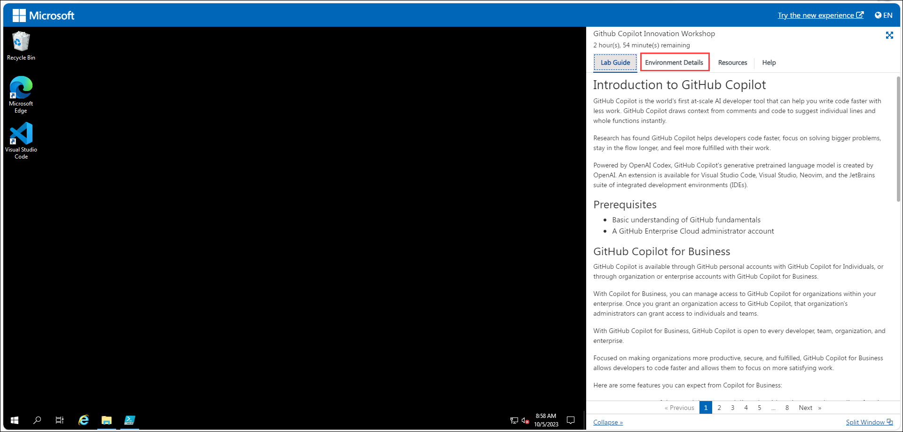
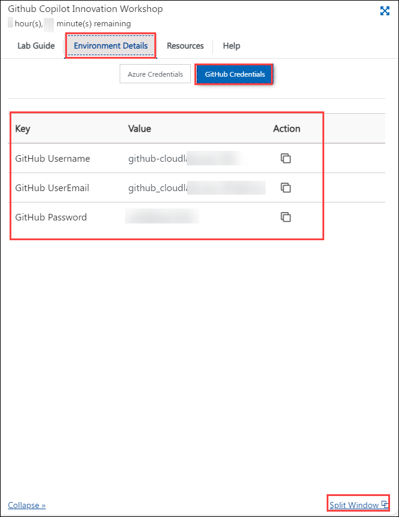
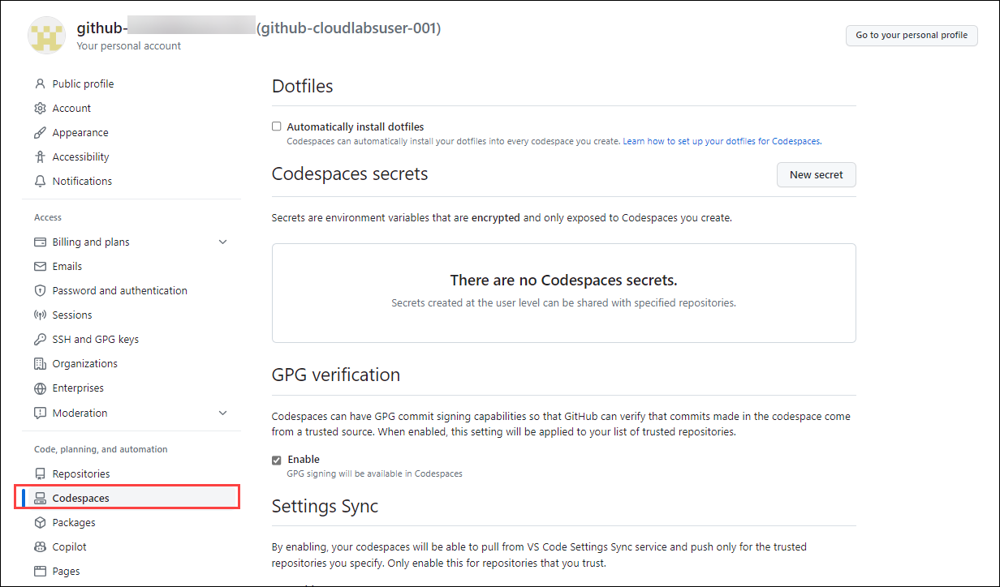

## Getting Started with Lab

1. You can see a virtual machine desktop 💻 (**LABVM**) is loaded on the left side in your browser. Use this virtual machine throughout the workshop to perform the lab. You can also connect to the virtual machine using any RDP client using the **LABVM** credentials provided in the **Environment Details** tab.
   
   

1. Once you are in **Environment Details** tab. Additionally, the credentials will also be emailed to your registered email address. Click on **GitHub Credentials** option to get GitHub User Credetials. You can also open the Lab Guide in a separate and full window by selecting the **Split Window** from the lower right corner. Also, you can start, stop and restart virtual machines from the **Resources** tab.
 
   
 
## Login to GitHub

1. In the LABVM desktop, click on the Microsoft Edge browser and navigate to GitHub login page using the provided URL below:

   ```
   https://github.com/login
   ```
   
1. On the **Sign in to GitHub** tab you will see the login screen, in that enter the following **email/username** **(1)** and **password** **(2)**. Then click on **Sign in** **(3)**. 

   * **Email/Username**: <inject key="GitHub UserEmail"></inject>
   * **Password**: <inject key="GitHub Password"></inject>
   
   
          
1. Next, to get the authentication code sign in to Outlook (https://outlook.office365.com/mail/) with the git credentials provided in the Environment details page and enter the verification code and click on **Verify**.

   

1. Right-click on **Start course**, click on **Copy link** and navigate to the link inside LabVM in the Edge browser where you have logged into GitHub in the previous steps.

   <!-- For start course, run in JavaScript:
   'https://github.com/new?' + new URLSearchParams({
     template_owner: 'skills',
     template_name: 'copilot-codespaces-vscode',
     owner: '@me',
     name: 'skills-copilot-codespaces-vscode',
     description: 'My clone repository',
     visibility: 'public',
   }).toString()
   -->

   [](https://github.com/new?template_owner=skills&template_name=copilot-codespaces-vscode&owner=%40me&name=skills-copilot-codespaces-vscode&description=My+clone+repository&visibility=public)
   
1. In the new tab, most of the prompts will automatically fill in for you. Leave defult for owner as you have already logged into GitHub to host the repository **(1)**. Select **Public** repository **(2)** and click the **Create repository** **(3)** button at the bottom of the form.

   

1. After your new repository is created, wait about 20 seconds and then refresh the page.

1. Once the repository is created, select your profile photo, then select **Your organizations**.

   

1. In your organization, from the left navigation pane, select **Codespaces**.

   

1. Scroll down and make sure under the **Editor preference** , **Visual Studio Code** is selected.

     

1. Now, click on **Next** from the lower right corner to move on to the next page.
